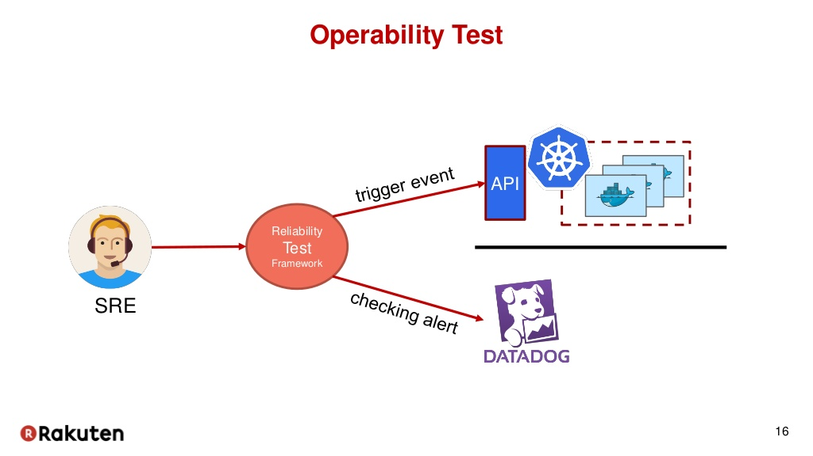

## Test Case Operability

Test Case Name: SRE(Site Reliability Engineering) Reliability Test Framework API

<H3>Precoditions:</H3> 
<li>Framework API</li>
<li>Connect API</li>
<li>Trigger Connect</li>

<H3>Inputs:</H3>  Sent Data 

<H3>actions:</H3>  Data event

<H3>Expceted Results:</H3>  Checking alert

