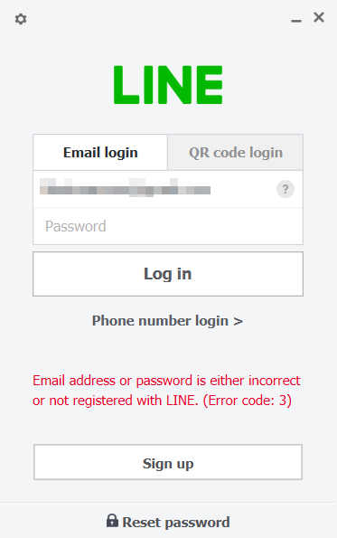

**LincPC

Invalid Test Cases

Precondition:
- เปิดโปรแกรม Line PC



Inputs:
- ใส่ Username ที่ถูกต้อง
- ใส่ Password ที่ผิด
Actions:
- เลือกรูปแบบการ login แบบใส่ Username Password
Expceted Results:
- แบบที่ 1
 ```แสดงข้อมูลในตัว LinePC ว่า "Email address or password is either incorrect or not registered with LINE.(Error code:3)"```
 ```มีการส่ง LINE มายังอุปกรณ์มือถือหลักว่า "ไม่สามารถเข้าสู่ระบบ LINE PC อุปกรณ์:xxx โปรดเปลี่ยนรหัสผ่านหากคุณไม่ได้พยายามเข้าสู่ระบบบนอุปกรณ์ดังกล่าว```
